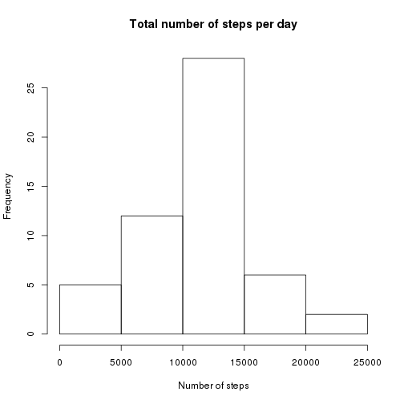
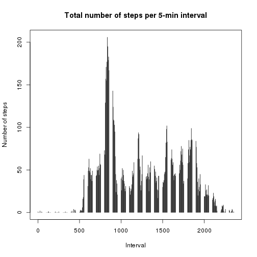
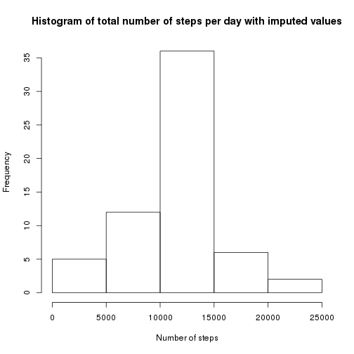
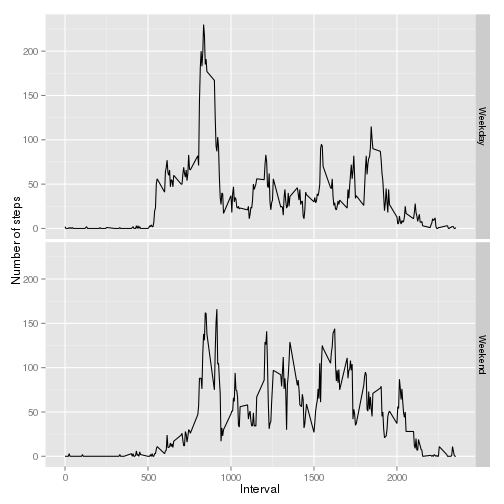

# Creation of an R markdown document for the
# Reproducible Research course by Coursera

This document is created as per Assignment #2 of the course.

## Data loading

Normally the file is already present in the repository, but I prefer to check if it's there just in case. Workflow:

* look for the file in the current directory
* if not found, download
* decompress
* read into a dataframe


```r
url <- 'https://d396qusza40orc.cloudfront.net/repstats%2Fstats%2Factivity.zip'
zipfile <- 'activity.zip'

if (!file.exists(zipfile)) {
        download.file (url, zipfile, method = 'curl')
} 
unzip(zipfile)
stats <- read.csv("activity.csv")
```

## Number of steps taken per day, histogram, mean and median values


```r
library('dplyr')
days <- group_by (stats, date)
finalData2 <- summarize(days, steps = sum(steps))
hist(finalData2$steps,
        main = 'Total number of steps per day',
        xlab = 'Number of steps')
```

 

```r
mean(finalData2$steps, na.rm = TRUE)
```

```
## [1] 10766.19
```

```r
median(finalData2$steps, na.rm = TRUE)
```

```
## [1] 10765
```

## Average daily activity pattern

Calculated by means of standard SQL

```r
library('sqldf')
avgPerInterval <- sqldf('select interval, avg(steps) as steps from stats group by interval')
plot (avgPerInterval, type = 'h', main = 'Total number of steps per 5-min interval',
	xlab = 'Interval', ylab = 'Number of steps')
```

 

```r
avgPerInterval[which.max(avgPerInterval$steps),]
```

```
##     interval steps
## 104      835   206
```

So the the winner (5-minute interval with the maximum number of steps) is 835

## Imputing missing data

Here we'll replace missing data (_steps_ variable) with the mean value of steps taken during this interval accross all the measurements

Number of incomplete cases:


```r
sum(is.na(stats$steps))
```

```
## [1] 2304
```

Imputing data


```r
completeData <- stats
for (i in 1:nrow(completeData)) { 
        if ( is.na(completeData[i,]$steps )) {
                completeData[i,]$steps <- avgPerInterval[avgPerInterval$interval == completeData[i,]$interval, "steps"]
        }
}

days <- group_by (completeData, date)
finalData4 <- summarize(days, steps = sum(steps))

hist(finalData4$steps,
        main = 'Histogram of total number of steps per day with imputed values',
        xlab = 'Number of steps')
```

 

```r
mean(finalData4$steps)
```

```
## [1] 10749.77
```

```r
median(finalData4$steps)
```

```
## [1] 10641
```

There are no tangible changes in the histogram after the missing values have been removed

## Difference in activity patterns between weekdays adn weekends

Here we'll add a column to the dataframe using _weekdays()_ function.


```r
library('ggplot2')
for (i in 1:nrow(completeData)) {
        day <- weekdays(as.Date(completeData[i, "date"]))
        if (day %in% c('Saturday', 'Sunday')) {
                completeData[i, "day"] <- 'Weekend'
        }
        else {
                completeData[i, "day"] <- 'Weekday'
        }
}

completeData <- transform(completeData, day = factor(day))
avgPerInterval5 <- sqldf('select interval, day, avg(steps) as steps from completeData group by interval, day')
ggplot(avgPerInterval5, aes(interval, steps)) + geom_line() + facet_grid(day ~ .) + xlab("Interval") + ylab("Number of steps")
```

 
